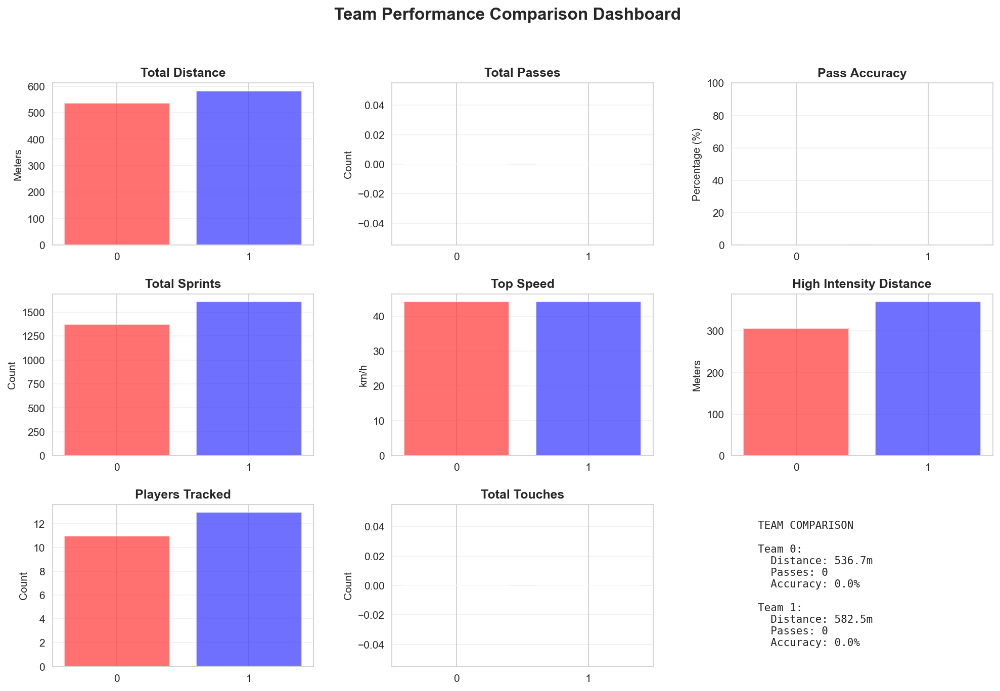
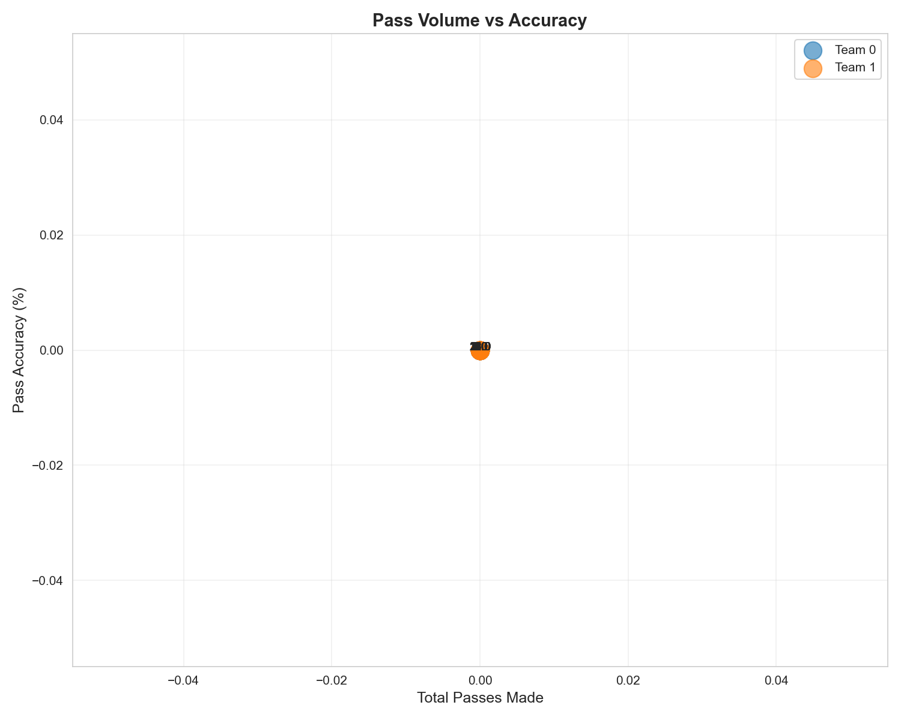

# ⚽ Football Tracking and Analytics System

<p align="center">
  
  
</p>

### 🎯 Objective
This project is an **end-to-end football (soccer) analytics system** designed to detect, track, and analyze player performance from broadcast match videos.  
It combines **YOLO-based detection**, **BoT-SORT tracking**, **team classification using SigLIP**, and **post-match performance analytics**.

---

## 🚀 Key Features

✅ **Player Detection** — Powered by YOLOv11 for real-time detection.  
✅ **Player Tracking** — Integrated **BoT-SORT** tracker with ReID for stable ID assignment.  
✅ **Team Classification** — Uses **SigLIP** embeddings to classify players by jersey color and team.  
✅ **Performance Analytics** — Computes metrics such as:
   - Sprint counts  
   - Player movement distances  
   - Speed distribution  
   - Team dominance and pass activity  
✅ **Heatmap Visualization** — Generates team and player-level heatmaps from positional data.  
✅ **Automated Video Export** — Creates processed output video with bounding boxes, IDs, and team labels.  

---

## 🧠 System Pipeline

       ┌────────────────────┐
       │    Input Video     │
       └─────────┬──────────┘
                 │
                 ▼
         [ YOLO Detection ]
                 │
                 ▼
          [ BoT-SORT Tracker ]
                 │
                 ▼
         [ SigLIP Team Classifier ]
                 │
                 ▼
        [ Player Metrics + Analytics ]
                 │
                 ▼
       [ Heatmaps & Performance Plots ]
                 │
                 ▼
         [ Exported Analysis Reports ]
                 │
                 ▼
         [ Output Video Generation ]


---

## 🗂️ Project Structure

Football-Tracking-and-Analytics-System/
│
├── 📁 src/ # Source code modules
│ ├── main_enhanced.py # Main pipeline entrypoint
│ ├── detection.py # YOLO detection logic
│ ├── botsort_tracker.py # BoT-SORT tracker integration
│ ├── team_classifier.py # Team classification (color-based)
│ ├── siglip_team_classifier.py # Team classification (SigLIP-based)
│ ├── feature_extractor.py
│ ├── analytics.py # Compute stats + visualizations
│ ├── export_manager.py # Handles file exports and reports
│ ├── visualizer.py # Overlay tracking info on frames
│ ├── config.py # User configuration parameters
│ └── utils.py # Helper functions
│
├── ⚙️ configs/
│ └── botsort.yaml # Tracker configuration
│
├── 🧩 models/
│ └── (YOLO & SigLIP weights, optional via LFS)
│
├── 📊 analytics_export/
│ ├── data/
│ │ ├── player_positions.csv
│ │ ├── player_metrics.csv
│ │ └── id_mappings.json
│ │
│ ├── heatmaps/
│ │ ├── team_0_heatmap.png
│ │ └── team_1_heatmap.png
│ │
│ ├── performance_plots/
│ │ ├── sprint_count.png
│ │ ├── speed_comparison.png
│ │ ├── team_comparison_dashboard.png
│ │ └── pass_accuracy_vs_volume.png
│ │
│ ├── player_heatmaps/
│ │ ├── player_1_heatmap.png
│ │ ├── player_2_heatmap.png
│ │ └── ...
│ │
│ └── reports/
│ └── analysis_summary.txt
│
├── 🎥 output/
│ └── processed_match.mp4 # Output video (detection + tracking)
│
├── 📄 requirements.txt # Dependencies
└── 📄 README.md


---

## 📈 Analytics Results

### 🧭 Team Heatmaps
<p align="center">
  
  
</p>

### 📊 Performance Plots
<p align="center">
  
  
  
  
</p>

---

## ⚙️ Installation

```bash
# Clone repository
git clone https://github.com/YoussefEsmael/Football-Tracking-and-Analytics-System.git
cd Football-Tracking-and-Analytics-System

# (Optional) Create virtual environment
conda create -n football_tracker python=3.10
conda activate football_tracker

# Install dependencies
pip install -r requirements.txt


▶️ Usage
1️⃣ Run Tracking & Analytics
python src/main_enhanced.py --video "path/to/match.mp4"

2️⃣ Output Generated

After successful execution, the following will be created:

output/
 └── processed_match.mp4              # Video with detections, tracking, and team overlays

analytics_export/
 ├── heatmaps/                        # Team and player positional heatmaps
 ├── performance_plots/               # Sprint and speed metrics
 ├── data/                            # Raw positional and metrics CSVs
 ├── player_heatmaps/                 # Individual player activity maps
 └── reports/analysis_summary.txt     # Match summary report

🧩 Configuration

You can modify detection, tracking, and classification behavior from:

src/config.py → frame rate, thresholds, paths

configs/botsort.yaml → ReID and tracker thresholds

Example snippet:

track_high_thresh: 0.6
appearance_thresh: 0.3
with_reid: true
proximity_thresh: 0.6

🧠 Future Improvements

 ReID fine-tuning for jersey consistency under occlusion

 Automatic event detection (pass, goal, tackle)

 Multi-view camera synchronization

 Interactive web dashboard for analytics visualization

🏆 Acknowledgements

This project builds upon the following technologies:

Ultralytics YOLOv11

BoT-SORT

SigLIP (Google Research)

TorchReID

OpenCV

Matplotlib

NumPy

🧾 Author

Youssef Esmael
📍 Egypt
📧 ismmailmuhamed@gmail.com

📜 License

This repository is released under the MIT License.
Feel free to use, modify, and build upon it with attribution.
