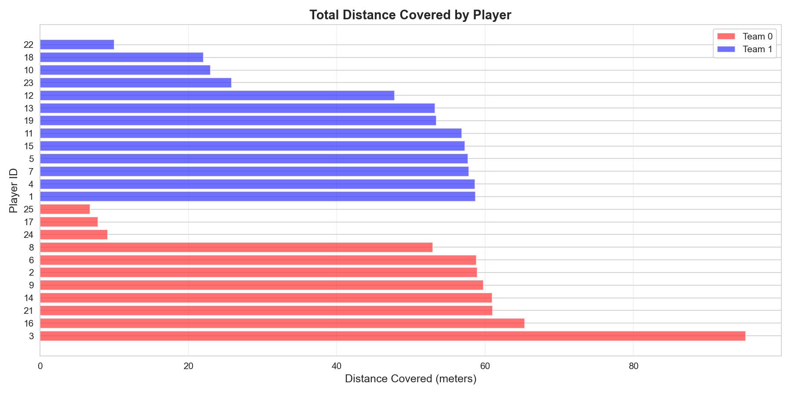
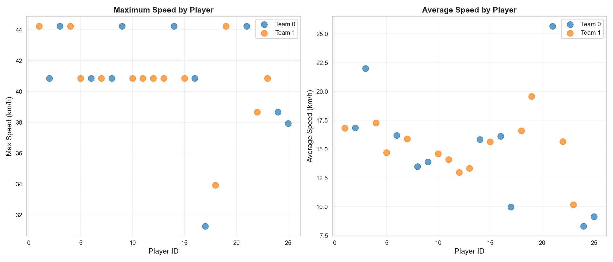
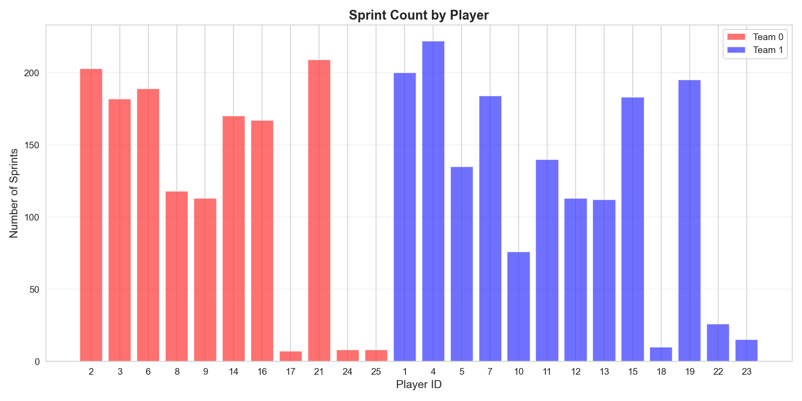
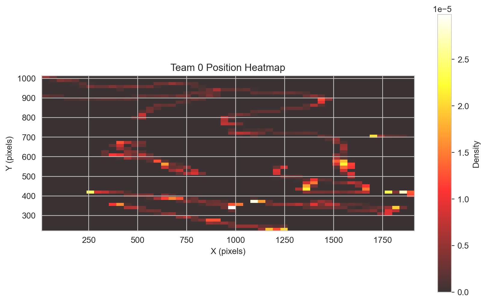
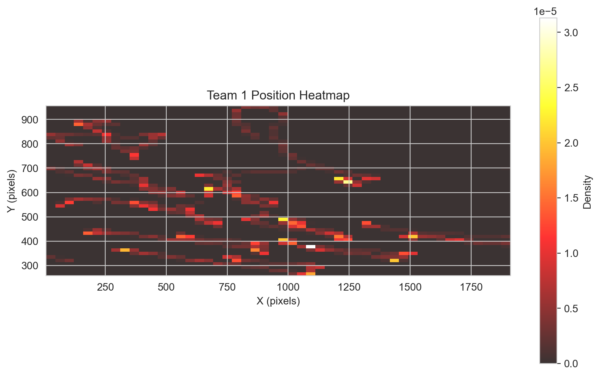

# ⚽ Advanced Football Tracking & Analytics System

A comprehensive computer vision pipeline for automatic football match analysis using state-of-the-art deep learning models. This system tracks players, classifies teams, and generates detailed performance analytics from broadcast video footage.

[](https://www.python.org/downloads/)
[](https://opensource.org/licenses/MIT)
[](https://github.com/YoussefEsmael/Football-Tracking-and-Analytics-System)

## 🎯 Features

### Core Capabilities
- **YOLOv11 Object Detection** - Detects players, goalkeepers, referees, and ball
- **BoT-SORT Multi-Object Tracking** - Maintains consistent player identities with built-in ReID
- **SigLIP + UMAP Team Classification** - Vision-language model for robust jersey color recognition
- **Global ID Management** - Persistent player tracking across occlusions and camera cuts
- **Advanced Analytics Engine** - Comprehensive performance metrics and tactical insights

### Analytics Outputs
- 📊 **Performance Metrics**: Distance covered, speed analysis, sprint detection
- 🎯 **Passing Analysis**: Pass networks, accuracy, completion rates
- 🗺️ **Heatmaps**: Individual player movement, team positioning, sprint zones
- ⚡ **Tactical Events**: Possession tracking, transitions, pressing intensity
- 🏟️ **Zone Control**: Field occupation analysis with 3x3 grid system
- 📈 **Visualizations**: Team comparison dashboards, performance plots

## 🎥 Results

### Demo Videos

#### With SigLIP Team Classification
Advanced vision-language model for robust team identification and tracking.

[](https://drive.google.com/file/d/1N09DJWhz78xAncd6sGoKwjOF22G6o_Se/view?usp=sharing)

#### Without SigLIP (Color-Based Classification)
Faster processing using traditional color histogram analysis.

[](https://drive.google.com/file/d/1jk_8f7A4X4MPNvZUvvRRLxw-Fg2DLlcV/view?usp=sharing)

---

### Sample Output Video
*Tracked players with team-colored ellipses, persistent IDs, and movement trails*


*Players automatically tracked and classified into teams with unique IDs*

### Performance Analytics

#### Distance Coverage Analysis
*Total distance covered by each player throughout the match*



#### Speed Metrics
*Maximum and average speed analysis for all tracked players*




#### Sprint Performance
*Number of high-intensity sprints per player*



### Player Heatmaps
*Individual movement patterns showing field positioning and coverage*

| Team A Movement | Team B Movement |
|:---:|:---:|
|  |  |

*Heatmaps reveal tactical positioning, work rate, and preferred zones of operation*

## 📁 Project Structure

```
Football-Tracking-and-Analytics-System/
├── main.py                          # Main pipeline script
├── config.py                        # Configuration parameters
├── botsort_tracker.py              # BoT-SORT integration
├── siglip_team_classifier.py       # SigLIP-based team classification
├── team_classifier.py              # Fallback color-based classifier
├── id_manager_simple.py            # Global ID management
├── visualizer.py                   # Enhanced visualization
├── analytics.py                    # Analytics engine
├── export_manager.py               # Data export & plots
├── utils.py                        # Utility functions
├── detection.py                    # Detection manager
├── feature_extractor.py            # Feature extraction
├── configs/
│   └── botsort.yaml                # BoT-SORT configuration
├── models/
│   └── best.pt                     # YOLOv11 model (download required)
├── analytics_export/               # Generated outputs
│   ├── data/                       # CSV exports
│   │   ├── player_positions.csv
│   │   ├── player_metrics.csv
│   │   ├── ball_positions.csv
│   │   └── pass_events.csv
│   ├── heatmaps/                   # Team movement heatmaps
│   │   ├── team_0_heatmap.png
│   │   └── team_1_heatmap.png
│   ├── player_heatmaps/           # Individual player heatmaps
│   ├── performance_plots/         # Performance visualizations
│   │   ├── distance_per_player.png
│   │   ├── speed_comparison.png
│   │   ├── pass_accuracy_vs_volume.png
│   │   ├── sprint_count.png
│   │   ├── high_intensity_distance.png
│   │   └── team_comparison_dashboard.png
│   └── reports/                   # Summary reports
└── README.md
```

**Note**: The following analytics are **currently disabled** due to accuracy limitations:
- `momentum/` - Momentum analysis
- `pass_networks/` - Pass network graphs  
- `possession/` - Possession timeline
- `transitions/` - Turnover analysis
- `zone_control/` - Field zone heatmaps

These features are experimental and may produce inconsistent results in the current version.

## 🚀 Installation

### Prerequisites
- Python 3.8+
- CUDA-capable GPU (recommended for real-time processing)
- 8GB+ RAM

### Step 1: Clone Repository
```bash
git clone https://github.com/YoussefEsmael/Football-Tracking-and-Analytics-System.git
cd Football-Tracking-and-Analytics-System
```

### Step 2: Create Virtual Environment
```bash
python -m venv venv
source venv/bin/activate  # On Windows: venv\Scripts\activate
```

### Step 3: Install Dependencies
```bash
pip install -r requirements.txt
```

**Core dependencies**:
- `ultralytics` - YOLOv11 detection & BoT-SORT tracking
- `transformers` + `torch` - SigLIP team classification
- `umap-learn` - Dimensionality reduction for clustering
- `opencv-python` - Video processing
- `scikit-learn` - Clustering algorithms
- `pandas` + `matplotlib` - Analytics & visualization

### Step 4: Download YOLOv11 Model
The custom-trained YOLOv11 model is **not included** in this repository due to file size.

📥 **Download Link**: [YOLOv11 Football Detection Model (Google Drive)](https://drive.google.com/file/d/15cyCqlcRULXXbgw_2761x7zFRlGGZSm9/view?usp=sharing)

**After downloading:**
1. Create `models/` directory if it doesn't exist
2. Place the downloaded `best.pt` file in `models/`
3. Verify the path matches `config.py`:
   ```python
   YOLO_MODEL_PATH = "models/best.pt"
   ```

**Model Info:**
- Framework: YOLOv11
- Classes: Player, Goalkeeper, Referee, Ball
- Training: Custom dataset with football-specific annotations
- Size: ~130 MB

## 📖 Usage

### Basic Usage
```bash
python main.py --video path/to/match.mp4 --out output/tracked_match.mp4
```

### Advanced Options
```bash
python main.py \
    --video input/match.mp4 \
    --out output/result.mp4 \
    --max-frames 1000 \
    --tracker-config configs/botsort.yaml \
    --no-siglip  # Use color-based classification instead
```

### Command-Line Arguments
- `--video` / `-v`: Path to input video (required)
- `--out` / `-o`: Path to output video (default: `output_tracked.mp4`)
- `--max-frames`: Maximum frames to process (0 = all frames)
- `--tracker-config`: Custom BoT-SORT YAML config
- `--no-siglip`: Disable SigLIP (use faster color-based team classification)

### Configuration

#### `config.py` - Main Settings
Customize these parameters based on your use case:

```python
# Detection
CONFIDENCE_THRESHOLD = 0.35          # Lower = more detections, higher = fewer false positives

# Global ID Management  
REID_SPATIAL_THRESHOLD = 250         # Max pixel movement between frames
REID_TEMPORAL_WINDOW = 60            # Frames to remember lost tracks

# Team Classification
TEAM_WARMUP_FRAMES = 25              # Frames before clustering teams
TEAM_CONFIDENCE_THRESHOLD = 0.4      # Minimum confidence for team assignment

# Analytics
HIGH_SPEED_THRESHOLD = 15.0          # km/h for high-intensity running
SPRINT_THRESHOLD = 20.0              # km/h for sprint detection

# Auto-adjust for high FPS videos
AUTO_ADJUST_FOR_FPS = True           # Scale thresholds based on video FPS
```

#### `configs/botsort.yaml` - Tracker Settings
Fine-tune tracking behavior:

```yaml
tracker_type: botsort

# Detection thresholds
track_high_thresh: 0.65              # High confidence threshold
track_low_thresh: 0.15               # Low confidence threshold  
new_track_thresh: 0.75               # Threshold for new tracks

# Track management
track_buffer: 120                    # Frames to keep lost tracks (2x for 50 FPS)
match_thresh: 0.80                   # IoU threshold for matching
fuse_score: true                     # Fuse detection + tracking scores

# ReID parameters
with_reid: true                      # Enable appearance-based ReID
proximity_thresh: 0.7                # Proximity threshold (relaxed)
appearance_thresh: 0.5               # Appearance similarity threshold
model: auto                          # Use built-in ReID model

# Camera motion compensation
gmc_method: sparseOptFlow            # Options: sparseOptFlow, orb, ecc, none

# Quality filters
min_box_area: 100                    # Minimum detection box area
aspect_ratio_thresh: 1.6             # Filter unrealistic aspect ratios

# Frame rate
frame_rate: 25
```

**For 50+ FPS videos**, this config already uses `track_buffer: 120` which is optimized for high frame rates.

**Key Parameters to Adjust:**
- `track_buffer`: Higher = remembers lost tracks longer (good for occlusions)
- `match_thresh`: Higher = stricter matching (fewer ID switches but more lost tracks)
- `proximity_thresh` / `appearance_thresh`: Balance between spatial and visual matching

## ⚠️ Known Limitations

### 1. **Re-Identification (ReID) Challenges**
- **Issue**: When a player temporarily leaves the frame (e.g., goes off-screen, behind referee) and reappears, they may be assigned a **new ID** instead of recovering their original ID
- **Impact**: Affects long-term tracking consistency and per-player statistics
- **Mitigation**: 
  - Increase `REID_TEMPORAL_WINDOW` in `config.py` for longer memory
  - Increase `track_buffer` in `botsort.yaml` 
  - Use higher FPS videos for better temporal continuity
- **Status**: Inherent limitation of current BoT-SORT + spatial-temporal matching approach

### 2. **Team Classification Edge Cases**
- **Issue**: Players with similar jersey colors (e.g., dark blue vs black) may be misclassified
- **Works Well**: Distinct team colors (red vs blue, white vs dark)
- **Mitigation**: SigLIP model provides better robustness than traditional color histograms which you can use here as well.

### 3. **Camera Angle Dependency**
- **Best Results**: Broadcast-style tactical camera (side view, elevated)
- **Limitations**: Close-ups, behind-goal views, and rapidly moving cameras reduce accuracy

### 4. **Disabled Analytics**
The following outputs are **experimental** and disabled due to accuracy concerns:
- Pass network detection (requires ball tracking improvements)
- Possession analysis (needs refined ball proximity logic)
- Zone control heatmaps (experimental)
- Transition/momentum analysis (experimental)

These features exist in the codebase but are not actively maintained.

## 🎯 Best Practices

### For Optimal Results:
1. **Video Quality**: Use 720p+ resolution, 25+ FPS
2. **Camera Angle**: Tactical/broadcast view covering most of the pitch
3. **Lighting**: Well-lit matches (avoid shadows, night games with poor lighting)
4. **Team Colors**: Distinct jersey colors produce best classification
5. **Configuration**: Adjust thresholds in `config.py` for your specific video characteristics

### For High FPS Videos (50+ FPS):
- Set `AUTO_ADJUST_FOR_FPS = True` in `config.py`
- Or manually increase:
  - `REID_SPATIAL_THRESHOLD` → 400+
  - `REID_TEMPORAL_WINDOW` → 120+
  - `track_buffer` in `botsort.yaml` → 120 (already set)

## 📊 Output Files

After processing, find results in `analytics_export/`:

### Data Exports (CSV)
- `data/player_positions.csv` - Frame-by-frame player positions
- `data/player_metrics.csv` - Per-player performance summary
- `data/ball_positions.csv` - Ball tracking data
- `data/pass_events.csv` - Detected passing events

### Visualizations (PNG)
- `heatmaps/team_0_heatmap.png` - Team A movement heatmap
- `heatmaps/team_1_heatmap.png` - Team B movement heatmap
- `player_heatmaps/player_X_heatmap.png` - Individual player heatmaps
- `performance_plots/distance_per_player.png` - Distance comparison
- `performance_plots/speed_comparison.png` - Speed metrics
- `performance_plots/pass_accuracy_vs_volume.png` - Pass analysis
- `performance_plots/sprint_count.png` - Sprint statistics
- `performance_plots/high_intensity_distance.png` - High-intensity running
- `performance_plots/team_comparison_dashboard.png` - Overall dashboard

### Summary
- `reports/analysis_summary.txt` - Text summary of results

## 🛠️ Troubleshooting

### "Cannot open video writer"
- **Solution**: Install alternative codecs or change output format:
  ```bash
  pip install opencv-contrib-python
  ```
  Or try different extension: `--out output.avi`

### "CUDA out of memory"
- **Solution**: Reduce batch size or use CPU:
  ```python
  # In config.py
  ENABLE_GPU = False
  ```

### "SigLIP failed to load"
- **Solution**: System will automatically fallback to color-based classification
- For GPU acceleration: Ensure PyTorch CUDA is installed correctly

### Poor tracking quality
1. Check video FPS and adjust `track_buffer` accordingly
2. Increase `CONFIDENCE_THRESHOLD` to reduce false detections
3. Verify YOLOv11 model is loaded correctly
4. Try processing a shorter clip first (use `--max-frames 500`)

## 🤝 Contributing

Contributions are welcome! Areas for improvement:
- [ ] Improved ReID model training for football-specific scenarios
- [ ] Enhanced occlusion handling algorithms
- [ ] Ball trajectory prediction
- [ ] Automatic highlight detection
- [ ] Real-time processing optimization

## 🙏 Acknowledgments

- **Ultralytics YOLOv11** - Object detection framework
- **BoT-SORT** - Multi-object tracking algorithm  
- **SigLIP** (Google) - Vision-language model for team classification
- **UMAP** - Dimensionality reduction for clustering

## 📞 Contact

**Author**: Ismail Mohamed  
**Email**: ismmailmuhamed@gmail.com  
**GitHub**: [@YoussefEsmael](https://github.com/YoussefEsmael)

For questions, bug reports, or feature requests:
- 📧 Email: ismmailmuhamed@gmail.com
- 🐛 Issues: [GitHub Issues](https://github.com/YoussefEsmael/Football-Tracking-and-Analytics-System/issues)
- 💬 Discussions: [GitHub Discussions](https://github.com/YoussefEsmael/Football-Tracking-and-Analytics-System/discussions)

---

⭐ **If you find this project useful, please consider giving it a star!** ⭐

## 🚀 Future Roadmap

- [ ] Improve ReID robustness for long-term tracking
- [ ] Real-time processing optimization
- [ ] Automatic highlight detection (goals, key moments)
- [ ] 3D tactical view with homography transformation
- [ ] Jersey number recognition
- [ ] Advanced tactical analysis (formations, pressing patterns)
- [ ] Web-based dashboard for live analysis

---

Made with ⚽ and 🧠 by Ismail Mohamed
